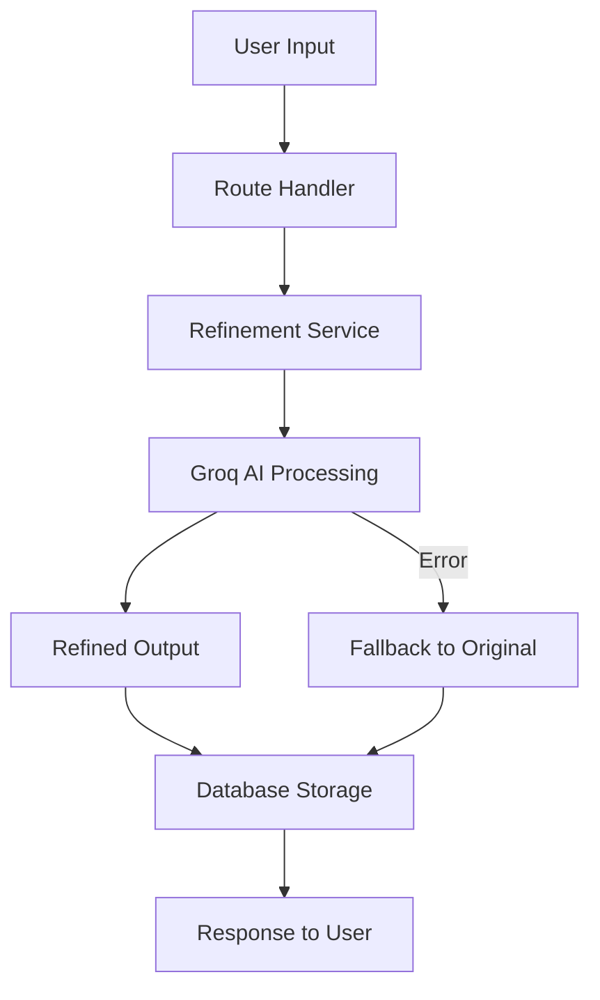

# User Input Refinement with Groq AI

This system automatically refines and improves user answers/responses before saving them to the database using Groq AI. This ensures all stored data is professional, specific, and high-quality.

## ✨ Features

### Automatic Input Refinement
- **Real-time processing**: User input is refined automatically before database storage
- **Context-aware**: Uses company, product, and domain context for better refinement  
- **Error handling**: Falls back to original input if refinement fails
- **Performance optimized**: Parallel processing for complex objects

### Supported Input Types

#### Single Text Fields
- `productName` - Makes product names professional and market-ready
- `productDescription` - Improves descriptions to be compelling and clear
- `valueProposition` - Refines value props to be benefit-focused and quantifiable  
- `personaName` - Standardizes persona titles to professional format
- `segmentName` - Makes segment names descriptive and specific
- `differentiation` - Enhances competitive differentiation statements

#### Complex Fields  
- `painPoint` - Makes pain points specific and business-impact focused
- `goal` - Improves goals to be measurable and actionable
- `responsibility` - Refines responsibilities to be role-appropriate
- `challenge` - Makes challenges concrete and solution-oriented
- `feature` - Converts features to customer-benefit focused language
- `useCaseDescription` - Improves use cases to include problem-solution-outcome

#### Array Fields
- `batchTextArray` - Batch processes arrays to ensure consistency and quality
- Handles: features, problems, pain points, goals, responsibilities, etc.

## 🔧 Implementation

### Service Layer
```javascript
// services/groqService.js
const { refineUserInput, refineComplexObject } = require('./services/groqService');

// Refine single field
const refined = await refineUserInput('productName', userInput, context);

// Refine complex object with multiple fields  
const refinedProduct = await refineComplexObject('product', productData, context);
```

### Route Integration
Refinement is automatically applied in these routes:

- `POST /:slug/products` - Product creation
- `PUT /:slug/products/:productId` - Product updates
- `POST /:slug/segments/:segmentId/personas` - Persona creation  
- `PUT /:slug/segments/:segmentId/personas/:personaId` - Persona updates
- `POST /:slug/segments` - Segment creation
- `PUT /:slug/segments/:segmentId` - Segment updates
- `PUT /:slug/icp` - ICP data updates
- `POST /:workspaceId/enhanced-icp` - Enhanced ICP data

## 📊 Examples

### Before & After Examples

#### Product Name
```
Before: "my cool ai tool"
After:  "AI-Powered Automation Platform"
```

#### Value Proposition  
```
Before: "we help companies do stuff better with ai"
After:  "Automate repetitive tasks and reduce operational costs by 40% with AI-powered workflow optimization"
```

#### Pain Points Array
```
Before: ["things are slow", "costs too much money"]
After:  ["Manual processes create 3-4 hour delays in daily workflows", 
         "Current solution costs exceed budget by 25% annually"]
```

#### Product Description
```
Before: "helps companies automate stuff"
After:  "Enterprise automation platform that streamlines business processes through intelligent workflow optimization. Reduces manual tasks by up to 60% while maintaining quality and compliance standards."
```

## 🎯 Context Usage

The refinement system uses context to provide more accurate improvements:

```javascript
const context = {
  companyName: "TechCorp",           // Company context
  domain: "techcorp.com",            // Website domain  
  industry: "Manufacturing",         // Industry vertical
  personaTitle: "VP of Engineering", // Target persona
  productName: "Automation Suite",   // Product context
  segmentName: "Enterprise Clients"  // Market segment
};
```

## 🚀 Benefits

### For Users
- **Better data quality**: Professional, consistent content
- **Time savings**: No need to manually polish responses  
- **Consistency**: Standardized tone and format across all content
- **Context relevance**: Industry and role-appropriate language

### For the System
- **Improved AI outputs**: Better source data leads to better AI-generated content
- **Professional appearance**: All stored content maintains high standards
- **Better analytics**: More consistent data enables better insights
- **Enhanced UX**: Users see their input elevated to professional standards

## 🧪 Testing

Run the test script to see refinement in action:

```bash
node test-refinement.js
```

This will demonstrate:
- Single field refinement
- Array processing  
- Complex object handling
- Error handling

## ⚙️ Configuration

### Environment Variables
- `GROQ_API_KEY` - Required for AI refinement functionality

### Refinement Settings
- **Temperature**: 0.3 (lower for more consistent results)
- **Max tokens**: 1000 per refinement call
- **Model**: llama3-70b-8192
- **Fallback**: Returns original input on any errors

## 🔄 Integration Flow



The system ensures zero data loss - if refinement fails for any reason, the original user input is preserved and saved. 